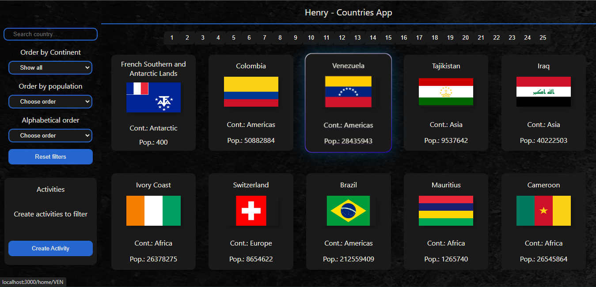

<h2 align="center">
Full Stack Web Developer :heart: from Entre Ríos, Argentina to :earth_americas:
</h2>

&nbsp;&nbsp;

## :pushpin: Languages and Tools:

&nbsp;&nbsp;

#### Front-end:

  
  
  
  
  
  

 
&nbsp;&nbsp;

#### Back-end:

  
  
  
  
  

  &nbsp;&nbsp;

#### Tools:

  
  
  
  

  

&nbsp;&nbsp;
 
  ## :pushpin: My proyects
 
 <h3>Concerteck</h3> 
 

  
 

 
   

<h3>Henry Countries</h3>

 

 

## 📫 How to reach me:
 
  
  
 

<!--
**LionelOrbe/LionelOrbe** is a ✨ _special_ ✨ repository because its `README.md` (this file) appears on your GitHub profile.

Here are some ideas to get you started:

- 🔭 I’m currently working on ...
- 🌱 I’m currently learning ...
- 👯 I’m looking to collaborate on ...
- 🤔 I’m looking for help with ...
- 💬 Ask me about ...
- 📫 How to reach me: ...
- 😄 Pronouns: ...
- ⚡ Fun fact: ...
-->
